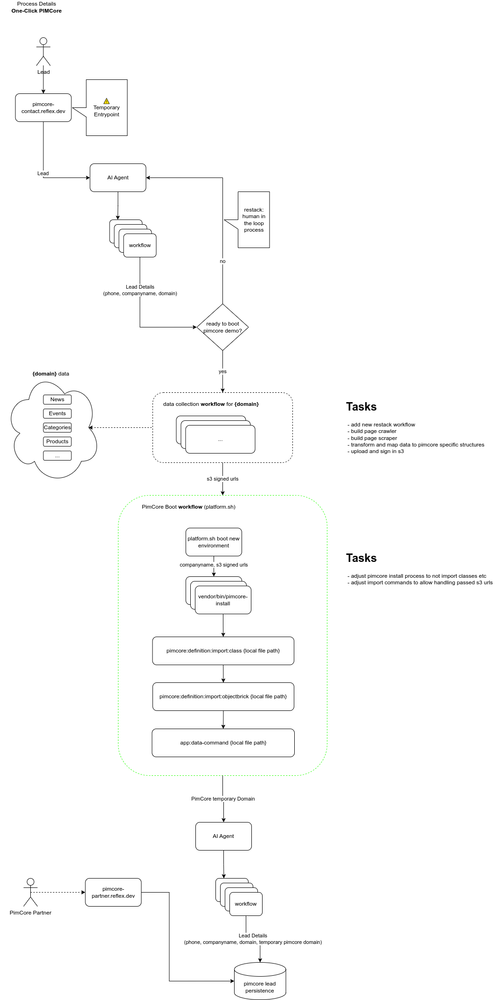

# Demo and Blue Print Application for Pimcore

This demo package is intended to be used for an automated AI agent driven ecommernce experience starting with a customer request.
Its far from beeing complete or final, lot of open ecommerce and pimcore standard functionalities are still undeveloped.
Since this is an unmaintained fork, dont use this project anywhere.

What we cover:
 - automated domain model creation based on customers domain
 - automated creation of products based on customers domain

What we dont cover:
 - CMS pages
 - Customer specific CI/CD
 - ai generated product detail pages (different structures) (twig files)
 - product listing pages and categories
 - [...]

# Installation & internal documentation (base project https://github.com/pimcore/demo):
- ``docker run -u `id -u`:`id -g` --rm -v `pwd`:/var/www/html pimcore/pimcore:php8.3-latest composer create-project --no-scripts patrickjaja/pimcore-ai-demo my-project`` (create database and user)
- ``docker compose exec php vendor/bin/console assets:install --symlink --relative``
- ``docker compose exec php vendor/bin/pimcore-install --mysql-host-socket=db --mysql-username=pimcore --mysql-password=pimcore --mysql-database=pimcore`` (create database and user)
- ``docker compose exec php vendor/bin/console cache:clear``
- ``docker compose exec php vendor/bin/console pimcore:definition:import:class class_ExampleProductType_export.json`` (create new product type)
- ``docker compose exec php vendor/bin/console pimcore:definition:import:objectbrick objectbrick_SaleInformation_export.json --force``  (attach sales object to new product type)
- ``docker compose exec php vendor/bin/console app:data-command data_ExampleProductType_export.json`` (import product for new product type)
- check http://localhost/admin -> data objects -> Product Data for new imported product (use preview do check rendered pdp)

# data structures
 - PimCore class import, allows to freely define the object data structures [class_ExampleProductType_export.json](class_ExampleProductType_export.json)
 - Pimcore reused objects (named objectbricks) need to be attached to a class: [objectbrick_SaleInformation_export.json](objectbrick_SaleInformation_export.json)
 - Produkt data import example based on imported structure: [data_ExampleProductType_export.json](data_ExampleProductType_export.json)

## personal notes
 ### start xdebug
 - php -d xdebug.mode=debug -d xdebug.client_host=172.23.0.1 -d xdebug.client_port=9003 -d xdebug.idekey="PHPSTORM" -d xdebug.start_with_request=yes bin/console  pimcore:definition:import:class class.json
 - docker-compose down --volumes
 - docker compose exec php vendor/bin/pimcore-install --mysql-host-socket=db --mysql-username=pimcore --mysql-password=pimcore --mysql-database=pimcore --skip-database-data --skip-database-data-dump
 - example preview url http://localhost/en/shop/Products/coffee-filters/EN-MelittaR-Original--100--braun--40-St~p1193?pimcore_object_preview=1193&dc=1739303623
 - http://localhost/en/shop/Products/EN-MelittaR-Original--100--braun--40-St~p1193

PimCore Project Stack Notes
 - https://docs.pimcore.com/platform/Pimcore/Deployment/Deployment_Tools/#potentially-useful-commands
 - https://docs.pimcore.com/platform/Workflow_Automation/Work_with_WAI

